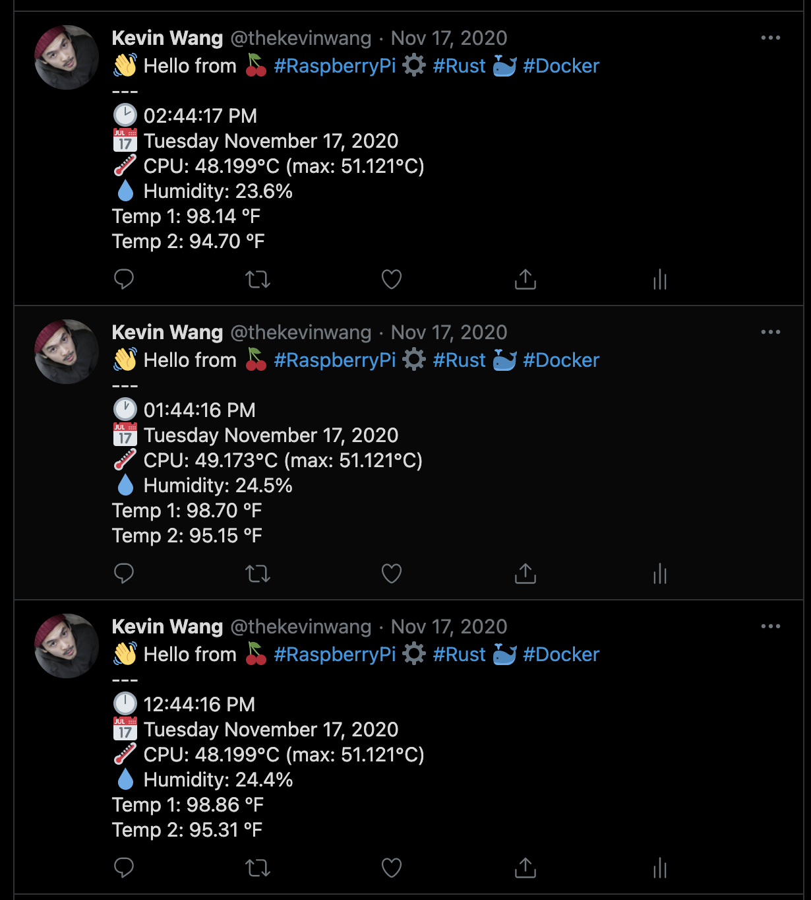

# Rust Raspberry Pi Twitter Bot

This project generates a Docker container that is meant to run on a Raspberry PI 4 Model B (**arm 7, 32 bit**).
This Tweets values detected by an attached [SenseHat](https://www.raspberrypi.org/products/sense-hat/)

## Annoying tweets!



## Prerequisites

- [Docker](https://docs.docker.com/get-docker/)
- A Raspberry Pi 4 Model B (**arm 7, 32 bit**), w/ internet

## Running

```sh
cp .env.example .env
# Manually update env vars
```

```sh
# Build the image
docker build --rm -t rust-bot .
# Run the container
docker run --rm -it -id --name do-stuff rust-bot:latest
```

## Possible Gotchas

- The code won't run on a desktop machine.
- It'll need to be run with Docker on a Rasperry Pi.
